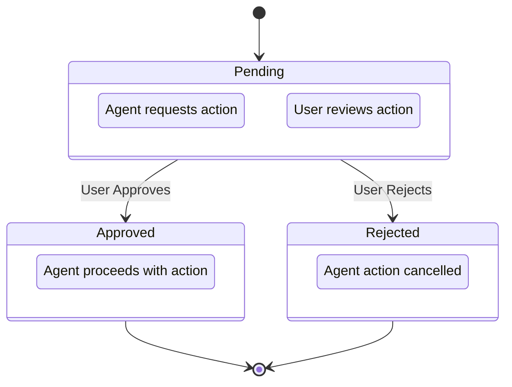

# Nulm: Kapsamlı Tasarım Stratejisi ve Analiz Raporu

Nulm, yerel makinede çalışan, AI ajanlarının dosya sistemi, shell komutları ve proje bağlamıyla güvenli bir şekilde etkileşime girmesini sağlayan bir Python MCP (Model Context Protocol) sunucusudur. Bu belge, ürünün görsel kimliğini, arayüz tasarımını, kullanıcı deneyimini ve teknik altyapısını yönlendirmek için hazırlanmış kapsamlı bir araştırma ve strateji planıdır.

---

## 1. Ürün Konumlandırması Analizi

Nulm, modern yazılım geliştirme süreçlerinde AI ajanlarının yeteneklerini güvenli bir şekilde yerel ortama taşıyan bir köprü görevi görür.

**Kategori:** Nulm, "Geliştirici Araçları" (Developer Tools) ve "AI Agent Altyapısı" (AI Agent Infrastructure) kategorilerinin kesişiminde yer alır. Özellikle "Agent Control Plane" (Ajan Kontrol Düzlemi) ve "Yerel Çalışma Zamanı" (Local Runtime) olarak konumlanır.

**Kullanıcı Kimliği:** Hedef kullanıcı, terminalde rahat hisseden, AI araçlarını iş akışına entegre eden ancak güvenlik ve kontrol konusunda taviz vermek istemeyen kıdemli yazılım geliştiricileri, DevOps mühendisleri ve sistem yöneticileridir.

**Çözülen Problem:** AI ajanlarının yerel dosya sistemlerine ve shell ortamlarına erişimi büyük bir güvenlik riski taşır. Nulm, bu erişimi şeffaf, denetlenebilir ve izin tabanlı (approval-based) bir yapıya kavuşturarak, ajanların "kara kutu" (black box) olmaktan çıkıp güvenilir asistanlara dönüşmesini sağlar.

**Güvenlik, Kontrol ve Yerellik Algısı:** Ürün, bulut tabanlı bir SaaS (Software as a Service) ürünü gibi değil, kullanıcının makinesine ait, hızlı ve doğrudan bir araç gibi hissettirmelidir. Tasarım dili, "verileriniz sizin makinenizde kalır" (local-first) felsefesini yansıtmalıdır.

---

## 2. Tasarım İlkeleri

Nulm'un görsel dili ve kullanıcı deneyimi aşağıdaki temel ilkeler üzerine inşa edilmelidir:

### Ürün Nasıl Hissettirmeli?

- **Teknik ama Erişilebilir:** Terminalin gücünü ve hızını, modern bir arayüzün okunabilirliği ile birleştirmelidir.
- **Şeffaf:** AI ajanı arka planda çalışırken ne yaptığını açıkça göstermeli, kullanıcıya her zaman "sistemin kontrolü bende" hissini vermelidir.
- **Hızlı ve Tepkisel:** Gecikmesiz (low-latency) bir deneyim sunmalı, animasyonlar abartılı değil, sadece geri bildirim amaçlı olmalıdır.

### Kaçınılması Gereken Görsel Tavırlar

- Jenerik, yuvarlak hatlı ve aşırı renkli "tüketici SaaS" görünümlerinden uzak durulmalıdır.
- Aşırı oyunlaştırma (gamification), maskotlar veya dekoratif "AI parlamaları" (gradient orbs) kullanılmamalıdır.
- Gereksiz boşluklardan (excessive whitespace) kaçınılmalı; bilgi yoğunluğu (information density) yüksek, ancak düzenli bir yapı tercih edilmelidir.

### CLI ve Dashboard Uyumu

CLI ve web dashboard, aynı tasarım sisteminin farklı ortamlardaki yansımaları olmalıdır. Renk kodlamaları (örneğin hata için kırmızı, onay için sarı), terminoloji ve tipografik hiyerarşi her iki tarafta da tutarlı olmalıdır.

---

## 3. Rakip ve Referans Araştırması

Geliştirici araçları ekosistemindeki başarılı örnekler incelendiğinde, Nulm için çıkarılabilecek temel dersler şunlardır:

| Referans Araç | Çıkarılan Tasarım Dersleri | Nulm İçin Uyarlanabilirliği |
|---------------|---------------------------|----------------------------|
| Warp | Terminal deneyimini bloklar (blocks) halinde yapılandırarak okunabilirliği artırır. | Nulm CLI çıktıları, ajanların eylemlerini ayrık bloklar halinde sunabilir. |
| Tailscale | Ağ güvenliği gibi karmaşık bir konumu, sade ve güven veren bir arayüzle sunar. Tasarımı abartısızdır. | Nulm'un yerel ağ ve izin yönetimi, Tailscale'in "sessiz güven" hissini örnek alabilir. |
| Linear | Yüksek performans, klavye odaklı navigasyon ve koyu tema ağırlıklı, "developer-first" estetiği. | Dashboard'da klavye kısayolları ve yüksek kontrastlı, yoğun bilgi mimarisi kullanılabilir. |
| Supabase | Açık kaynaklı ve teknik doğasını, marka rengi (yeşil) ile terminal hissi veren bir tasarımla birleştirir. | Nulm, terminal estetiğini web arayüzüne taşırken Supabase'in "kod odaklı" (code-first) yaklaşımını benimseyebilir. |
| Raycast | Minimalist koyu tema, ince çizgiler (hairline borders) ve işlevsel odaklı tasarım. | Onay (approval) pencereleri ve arama/filtreleme alanları Raycast'in hız hissini yansıtabilir. |

---

## 4. Marka Kişiliği

Nulm'un marka kişiliği; teknik uzmanlık, yerel çalışma (local-first) ve şeffaf kontrol (agent-control-plane) üzerine kuruludur. Bu kişiliği yansıtacak yaratıcı yön önerileri:

### 1. "The Secure Gateway" (Güvenli Geçit)
Odak noktası izinler ve güvenliktir. Görsel dil, askeri düzeyde doğruluk, net sınırlar ve keskin tipografi içerir. Hata affetmeyen, ciddi bir ton.

### 2. "The Transparent Engine" (Şeffaf Motor)
Odak noktası görünürlüktir. Ajanın ne düşündüğü ve ne yaptığı bir camın arkasından izleniyormuş gibi tasarlanır. Loglar ve akışlar ön plandadır.

### 3. "The Terminal Evolved" (Evrimleşmiş Terminal)
Tamamen geliştirici alışkanlıklarına odaklanır. Monospace fontlar, terminal renk paletleri ve tamamen klavye ile yönetilebilir bir arayüz.

---

## 5. Tema ve Renk Stratejisi

Nulm için kesin palet üretilmemekle birlikte, renk stratejisi aşağıdaki temeller üzerine kurulmalıdır:

### Koyu Tema (Dark Theme) Önceliği
Geliştirici araçlarında (özellikle terminal ve IDE uzantılarında) koyu tema endüstri standardıdır. Nulm, varsayılan olarak koyu tema ile gelmeli, "gece çalışan geliştirici" ergonomisini desteklemelidir. Göz yormayan, düşük doygunluklu (low-saturation) koyu griler ve antrasit tonları ana zemin olmalıdır.

### Ana Vurgu Rengi (Primary Accent)
Ana renk, "güven, teknoloji ve yerellik" hissini taşımalıdır. Elektrik mavisi, neon yeşili veya teknik bir mor gibi, karanlık zeminde parlayan ancak dekoratif olmayan işlevsel bir renk seçilmelidir.

### Durum Renkleri (Status Colors)

| Durum | Açıklama | Önerilen Renk |
|-------|----------|---------------|
| Approval (Onay Bekliyor) | Dikkat çekici ama tehlike ifade etmeyen bir renk. Kullanıcıyı eyleme çağırır. | Kehribar/Sarı |
| Blocked/Danger (Engellendi/Tehlike) | Kesin ve durdurucu bir Kırmızı. Sadece kritik güvenlik ihlallerinde veya reddedilen işlemlerde kullanılmalıdır. | Kırmızı |
| Running/Active (Çalışıyor) | Ana vurgu rengi veya sakin bir Mavi. Sürecin devam ettiğini belirtir. | Mavi |
| Success (Başarılı) | Geleneksel Yeşil. | Yeşil |

### CLI ve Dashboard Renk Dozajı

**CLI:** Renkler çok idareli kullanılmalıdır. Metinlerin %90'ı varsayılan terminal renginde olmalı, sadece durum etiketleri (örn. `[PENDING]`, `[ERROR]`) renklendirilmelidir.

**Dashboard:** Renkler, hiyerarşiyi belirlemek için kullanılmalıdır. Geniş renk blokları yerine, ince çizgiler, ikonlar ve metin vurguları tercih edilmelidir.

---

## 6. Logo Yönü Araştırması

Logo tasarımı için aşağıdaki konsept yönleri değerlendirilebilir:

| Konsept Yönü | Açıklama | Avantajlar | Riskler | Uygulanabilirlik |
|--------------|----------|------------|---------|------------------|
| Bridge / Connection | İnsan kontrolü ile AI ajanı arasındaki köprüyü simgeler. | Anlaması kolay, bağlayıcı bir mesaj verir. | Çok jenerik olabilir, SaaS ürünleriyle karışabilir. | Yüksek. Basit geometrik şekillerle (iki noktanın birleşimi) ifade edilebilir. |
| Terminal / Prompt | `>` veya `_` gibi klasik terminal sembollerinin modern bir yorumu. | Geliştirici kitlesiyle anında bağ kurar. | Çok fazla CLI aracı benzer logolar kullanır, ayrışmak zor olabilir. | Çok Yüksek. CLI ikonografisine kolayca uyarlanır. |
| Permission Gateway | Kilit, kapı veya filtre (mesh) metaforları. | Ürünün güvenlik ve "onay" (approval) mekanizmasını vurgular. | Fazla kısıtlayıcı veya "antivirüs" yazılımı gibi algılanabilir. | Orta. Güvenlik hissini modern bir şekilde vermek ustalık ister. |
| Local Runtime | Kutu, makine veya izole bir çekirdek (core) tasarımı. | "Bulutta değil, senin makinenizde" mesajını güçlü verir. | Soyut kalabilir, ajan (agent) kavramını yansıtmayabilir. | Yüksek. Konteyner/Docker estetiğine yakın bir dil kurulabilir. |

---

## 7. Dashboard Bilgi Mimarisi (Information Architecture)

Dashboard, kullanıcının ajanların ne yaptığını anında anlaması ve gerektiğinde müdahale etmesi için tasarlanmalıdır. Bilgi hiyerarşisi şu şekilde olmalıdır:

1. **Pending Approvals (Bekleyen Onaylar):** En üstte ve en görünür alanda olmalıdır. Kullanıcının müdahalesini gerektiren ve süreci bloke eden en kritik öğedir.
2. **Active Session / Connected State:** Sistemin şu an çalışıp çalışmadığı, ajanın bağlı olup olmadığı bilgisi başlık (header) alanında sürekli görünür olmalıdır.
3. **Tool Calls & Shell Commands (Aktivite Akışı):** Ajanın o an yaptığı işlemler (hangi aracı çağırdığı, hangi komutu çalıştırdığı) canlı bir akış (feed) olarak sunulmalıdır.
4. **File Changes / Patches:** Dosya sisteminde yapılan değişiklikler (git diff benzeri bir görünümle) detaylı inceleme için erişilebilir olmalıdır.
5. **Current Project & Session Metadata:** Hangi dizinde çalışıldığı, hangi LLM modelinin kullanıldığı gibi bağlam bilgileri yan panelde veya alt bilgi olarak yer alabilir.
6. **Logs & Security Notes:** Detaylı hata ayıklama (debugging) logları ve güvenlik uyarıları, gerektiğinde genişletilebilen (collapsible) panellerde tutulmalıdır.

---

## 8. UI Layout (Arayüz Düzeni) Planı

### Tek Sayfa Dashboard
Evet. Nulm bir yönetim paneli değil, bir "kontrol düzlemi"dir (control plane). Geliştirici bağlam değiştirmeden (context switching) tüm süreci tek ekranda görmelidir.

### Sol Navigasyon
Hayır, geleneksel bir sol menü (sidebar) yerine, ana odak "Aktivite Akışı" (Activity Feed) ve "Onaylar" olmalıdır. Ayarlar veya proje seçimi üst menüde (header) veya modal pencerelerde çözülebilir.

### Approval Akışı
Akışın tam ortasında (inline) veya ekranın sağ tarafında sabit bir "Action Center" (İşlem Merkezi) panelinde görünmelidir. Kullanıcı neye onay verdiğinin bağlamını (hangi komut, hangi dosya) anında görebilmelidir.

### Loglar
Loglar ana odak olmamalıdır. Ana odak "Anlamlı Eylemler" (Tool Calls/Commands) olmalıdır. Ham loglar (raw logs) sadece "Detayları Gör" denildiğinde açılan bir terminal penceresinde sunulmalıdır.

### Terminal Estetiği
Sadece komut çıktıları (stdout/stderr) ve kod değişiklikleri (diffs) gösterilirken kullanılmalıdır. Arayüzün geri kalanı modern ve tipografik olarak temiz olmalıdır.

### Mobil Destek
Masaüstü (Desktop) kesinlikle önceliklidir. Ancak, geliştirici bilgisayar başında değilken telefonundan bir işleme "Onay" (Approve) veya "Red" (Reject) verebilmesi için, onay akışı mobil uyumlu (responsive) olmalıdır.

---

## 9. CLI Tema Planı

CLI deneyimi, gürültüsüz ve yönlendirici olmalıdır:

| Durum | Format | Görsel Öğeler |
|-------|--------|---------------|
| Bağlantı Linki & Dashboard URL | Mavi veya mor gibi tıklanabilir olduğunu hissettiren, altı çizili format | Terminal destekliyorsa hyperlink |
| Başarı Mesajı | `[✓] İşlem tamamlandı` | Yeşil renkli küçük bir ikon/sembol |
| Hata Mesajı | `[!] Hata: Dosya bulunamadı` | Kırmızı renkli, okunabilir hata metni (stack trace değil) |
| Approval Bekleme | `[?] Onay Bekleniyor: rm -rf /tmp/cache` | Sarı renkli, yanıp sönen (pulsing) bir imleç veya animasyon (spinner) |
| Blocked/Risky Command | `[BLOCKED]` | Kırmızı arka plan üzerine beyaz metin, güvenlik politikası açıklaması |
| Config Path | Loş (dimmed) gri renkte | Bağlam bilgisi olarak verilir |

---

## 10. Uygulama Yol Haritası (Implementation Roadmap)

### Phase 1: Discovery & Brand Direction (1-2 Hafta)
- Marka kişiliğinin kesinleştirilmesi ("The Secure Gateway" veya "The Transparent Engine").
- Logo konseptlerinin eskiz edilmesi ve tipografi/renk paleti temellerinin atılması.

### Phase 2: CLI Theme Mapping (1 Hafta)
- Terminal çıktıları için durum kodlarının (success, error, pending) renk ve ikon eşleştirmelerinin yapılması.
- CLI kütüphanesine (örn. Rich veya Textual) bu temanın entegre edilmesi.

### Phase 3: Dashboard Wireframe & IA (2 Hafta)
- Tek sayfalık dashboard düzeninin (layout) tel kafes (wireframe) çizimleri.
- "Approval" (Onay) akışının kullanıcı deneyimi testleri.

### Phase 4: Visual System & Component Inventory (2-3 Hafta)
- Wireframe'lerin üzerine seçilen görsel kimliğin (dark theme, hairline borders, monospace fonts) uygulanması.
- Butonlar, log panelleri, kod diff görünümleri gibi bileşenlerin (components) Figma'da kütüphane haline getirilmesi.

### Phase 5: Implementation & Integration (Sürekli)
- Tasarım sisteminin koda (örn. Tailwind CSS veya benzeri bir framework ile) dökülmesi.
- MCP server state'inin WebSocket veya benzeri bir yöntemle frontend'e bağlanması.

### Phase 6: Test & Validation Checklist
- [ ] CLI'da yüksek bilgi akışı olduğunda okunabilirlik test edildi mi?
- [ ] Dashboard'da onay bekleyen işlemler anında fark ediliyor mu?
- [ ] Koyu tema kontrast oranları erişilebilirlik (accessibility) standartlarına uygun mu?
- [ ] Yerel çalışma (local-first) hissi, gecikmesiz arayüz tepkileriyle sağlanıyor mu?

---

## 11. API Endpoint Listesi ve Response Şemaları

Bu bölüm mevcut backend ile hizalıdır. Dashboard HTTP sunucusu
`src/claude_bridge/control_plane_dashboard.py` içinde yerel ve token korumalı olarak çalışır.
Endpointler `/api/v1` prefixi kullanmaz. Token, URL query parametresi (`?token=...`) veya
`X-Claude-Bridge-Token` headerı ile gönderilir.

### 11.1. `GET /api/status`

Dashboard'un tekil okuma modelini döndürür: görevler, onaylar, kullanıcı mesajları ve görev özeti.

**Yanıt Şeması (JSON):**
```json
{
  "schema_version": "control_plane.dashboard.v1",
  "state_dir": "/Users/example/.claude-bridge/control-plane",
  "summary": {
    "schema_version": "control_plane.v1",
    "total": 1,
    "by_status": {
      "pending": 0,
      "queued": 0,
      "planning": 0,
      "running": 1,
      "in_progress": 0,
      "blocked": 0,
      "approval_pending": 0,
      "testing": 0,
      "failed": 0,
      "completed": 0,
      "cancelled": 0
    }
  },
  "tasks": [
    {
      "schema_version": "control_plane.v1",
      "id": "task_abc123",
      "title": "Review release notes",
      "status": "running",
      "created_at": "2026-05-19T10:20:00Z",
      "updated_at": "2026-05-19T10:25:00Z",
      "summary": "Checking docs and validation output.",
      "metadata": {"source": "workflow"}
    }
  ],
  "approvals": [
    {
      "schema_version": "control_plane.v1",
      "id": "approval_xyz789",
      "title": "Run shell command",
      "status": "pending",
      "tool": "run_shell",
      "command": "pytest tests/test_config.py -q",
      "reason": "Validation requested",
      "created_at": "2026-05-19T10:25:15Z",
      "updated_at": "2026-05-19T10:25:15Z",
      "expires_at": "2026-05-19T10:55:15Z",
      "metadata": {"risk": "low"}
    }
  ],
  "messages": [
    {
      "schema_version": "control_plane.v1",
      "id": "message_def456",
      "status": "queued",
      "message": "Please continue with the release checklist.",
      "created_at": "2026-05-19T10:28:30Z",
      "updated_at": "2026-05-19T10:28:30Z",
      "metadata": {"source": "dashboard"}
    }
  ]
}
```

### 11.2. `GET /api/messages`

Dashboard üzerinden yazılmış kullanıcı mesajlarını listeler.

**Yanıt Şeması (JSON):**
```json
{
  "schema_version": "control_plane.messages.v1",
  "messages": [
    {
      "schema_version": "control_plane.v1",
      "id": "message_def456",
      "status": "queued",
      "message": "Please continue with the release checklist.",
      "created_at": "2026-05-19T10:28:30Z",
      "updated_at": "2026-05-19T10:28:30Z",
      "metadata": {"source": "dashboard"}
    }
  ]
}
```

### 11.3. `POST /api/messages`

Dashboard'dan ajanların daha sonra alabileceği bir kullanıcı mesajı kuyruğa ekler.

**İstek Şeması (JSON):**
```json
{
  "message": "Please continue with the release checklist."
}
```

**Yanıt Şeması (JSON):**
```json
{
  "ok": true,
  "record": {
    "schema_version": "control_plane.v1",
    "id": "message_def456",
    "status": "queued",
    "message": "Please continue with the release checklist.",
    "created_at": "2026-05-19T10:28:30Z",
    "updated_at": "2026-05-19T10:28:30Z",
    "metadata": {"source": "dashboard"}
  }
}
```

### 11.4. `POST /api/tasks/{task_id}/cancel`

Bir kontrol düzlemi görevini iptal eder.

**İstek Şeması (JSON):**
```json
{
  "reason": "Superseded by a newer release task."
}
```

**Yanıt Şeması (JSON):**
```json
{
  "ok": true,
  "record": {
    "schema_version": "control_plane.v1",
    "id": "task_abc123",
    "title": "Review release notes",
    "status": "cancelled",
    "created_at": "2026-05-19T10:20:00Z",
    "updated_at": "2026-05-19T10:31:00Z",
    "summary": "Superseded by a newer release task.",
    "metadata": {
      "source": "workflow",
      "dashboard_reason": "Superseded by a newer release task.",
      "cancelled_by": "dashboard"
    }
  }
}
```

### 11.5. `POST /api/approvals/{approval_id}/approve`

Bir bekleyen onayı onaylar.

**İstek Şeması (JSON):**
```json
{
  "reason": "User reviewed command."
}
```

**Yanıt Şeması (JSON):**
```json
{
  "ok": true,
  "record": {
    "schema_version": "control_plane.v1",
    "id": "approval_xyz789",
    "title": "Run shell command",
    "status": "approved",
    "tool": "run_shell",
    "command": "pytest tests/test_config.py -q",
    "reason": "User reviewed command.",
    "created_at": "2026-05-19T10:25:15Z",
    "updated_at": "2026-05-19T10:31:00Z",
    "expires_at": "2026-05-19T10:55:15Z",
    "metadata": {
      "risk": "low",
      "dashboard_reason": "User reviewed command.",
      "decided_by": "dashboard"
    }
  }
}
```

### 11.6. `POST /api/approvals/{approval_id}/reject`

Bir bekleyen onayı reddeder. Yanıt yapısı approve ile aynıdır; `status` değeri `denied` olur.

### 11.7. `POST /api/approvals/{approval_id}/allow_always`

Onayı onaylar ve ilgili araç için komutun ilk tokenını `auto_approve_patterns` listesine ekler.
Bu aksiyon sadece approval kaydında hem `tool` hem `command` bulunduğunda uygulanabilir.

**Yanıt Şeması (JSON):**
```json
{
  "ok": true,
  "record": {
    "approval": {
      "schema_version": "control_plane.v1",
      "id": "approval_xyz789",
      "status": "approved",
      "tool": "run_shell",
      "command": "pytest tests/test_config.py -q",
      "metadata": {
        "decided_by": "dashboard",
        "allow_always_pattern": "pytest"
      }
    },
    "pattern": {
      "tool": "run_shell",
      "pattern": "pytest"
    }
  }
}
```

### 11.8. Henüz Backend'de Olmayan Yüzeyler

`GET /api/v1/activity`, `GET /api/v1/approvals`, `POST /api/v1/approvals/{id}/decide` ve WebSocket
endpointleri mevcut backend'de yoktur. Aktivite özeti MCP tarafındaki `activity_summary` aracıyla,
stream geçmişi ise full profildeki notification araçlarıyla temsil edilir; dashboard HTTP API'si
şu an ayrı bir activity feed endpointi sunmaz.

---

## 12. Veri Güncelleme Stratejisi

Nulm dashboard, gerçek zamanlıya yakın bir deneyim sunmalıdır. Bu, özellikle `pending_approvals` ve `activity` akışları için kritiktir. İki ana strateji değerlendirilmiştir:

### Polling (Periyodik Sorgulama)
Basit ve uygulaması kolaydır. Belirli aralıklarla (örn. 1-5 saniye) sunucuya yeni veri olup olmadığını sormayı içerir.

- **Avantajları:** Kolay implementasyon, her HTTP sunucusuyla uyumlu.
- **Dezavantajları:** Gecikme (polling aralığına bağlı), sunucu ve istemci üzerinde gereksiz yük (veri değişmese bile sürekli istek).

### WebSocket (WS)
Sunucu ve istemci arasında kalıcı, çift yönlü bir iletişim kanalı kurar. Veri değiştiğinde sunucu anında istemciye bildirim gönderir.

- **Avantajları:** Gerçek zamanlı güncellemeler, daha az ağ trafiği (gereksiz istek yok), daha iyi kullanıcı deneyimi.
- **Dezavantajları:** Daha karmaşık implementasyon, sunucu tarafında WebSocket desteği gerektirir.

**Mevcut durum:** Dashboard backend şu an token korumalı HTTP polling modeliyle çalışır. Ana okuma
endpointi `GET /api/status`, mesaj okuma/yazma endpointi `GET/POST /api/messages`, mutasyon
endpointleri ise görev iptali ve approval kararlarıdır.

**İleriki karar:** WebSocket veya SSE, pending approvals ve activity feed için daha iyi bir kullanıcı
deneyimi sağlayabilir; ancak bu, mevcut backend sözleşmesi değil, UI sonrası ayrı bir geliştirme
konusu olarak ele alınmalıdır.

---

## 13. Approval Flow State Machine (Onay Akışı Durum Makinesi)

Onay akışı, bir eylemin `pending` durumundan `approved` veya `rejected` durumuna geçişini görsel olarak da desteklemelidir.



### Görsel Animasyon Önerisi

| Durum | Dashboard Davranışı | CLI Davranışı |
|-------|---------------------|---------------|
| **Pending (Beklemede)** | Onay kartı veya satırı, hafifçe yanıp sönen (pulsing) bir kenarlık veya arka plan rengi ile kullanıcının dikkatini çeker. | `[?] Onay Bekleniyor` mesajı ile birlikte bir spinner animasyonu gösterilir. |
| **Approved (Onaylandı)** | Kartın veya satırın rengi anlık olarak yeşile döner ve hafif bir "başarı" animasyonu (örn. küçük bir onay işareti belirmesi) gösterilir. | `[✓] İşlem tamamlandı` şeklinde güncellenir. |
| **Rejected (Reddedildi)** | Kartın veya satırın rengi anlık olarak kırmızıya döner ve kaybolurken veya grileşirken bir "reddedildi" ikonu gösterilir. | `[!] İşlem reddedildi` şeklinde güncellenir. |

Bu animasyonlar, kullanıcının eylemlerinin anlık geri bildirimini sağlayarak kontrol hissini pekiştirecektir.

---

## 14. Frontend Build Setup (Vite + React)

Nulm dashboard için modern, hızlı ve geliştirici dostu bir frontend geliştirme ortamı hedeflenmektedir. Bu bağlamda **Vite** ve **React** kombinasyonu tercih edilmiştir.

### Teknolojiler
- **Framework:** React (TypeScript ile)
- **Build Tool:** Vite
- **Styling:** Tailwind CSS (hızlı UI geliştirme ve tutarlılık için)

### Proje Yapısı
Frontend uygulaması, ana nulm projesinin `frontend/` dizini altında konumlandırılacaktır.

```
nulm/
├── backend/                  # Python MCP server ve API kodları
├── frontend/
│   ├── public/
│   ├── src/
│   │   ├── assets/
│   │   ├── components/
│   │   ├── pages/
│   │   ├── App.tsx
│   │   ├── main.tsx
│   │   └── index.css
│   ├── index.html
│   ├── package.json
│   ├── tsconfig.json
│   └── vite.config.ts
├── docs/
└── README.md
```

### Geliştirme ve Build Süreci
- **Geliştirme:** `npm run dev` komutu ile Vite geliştirme sunucusu başlatılacak.
- **Üretim:** `npm run build` komutu ile optimize edilmiş statik dosyalar `frontend/dist/` dizinine derlenecek.
- **Sunum:** Bu statik dosyalar, nulm Python sunucusu tarafından servis edilebilir veya ayrı bir web sunucusu (örn. Nginx) aracılığıyla sunulabilir.

Bu yapılandırma, hızlı iterasyon, modern geliştirme pratikleri ve ölçeklenebilirlik sağlayacaktır.
