# Multi-Agent Architecture Deep Research and Critical Audit

Date: 2026-05-19

Scope: Nulm / claude-bridge Master/Sub-Agent architecture, including the local MCP execution layer,
agent quality layer, workflow engine, control plane, permissions, memory, messaging, audit, and
dashboard-adjacent background task model.

## Executive Verdict

The current system is not a production-grade multi-agent architecture. It is a secure local MCP tool
server with early agent-shaped modules layered on top. The execution substrate is much stronger than
the agent layer: file/shell boundaries, audit, guard policy, control plane, and dashboard safety are
real design assets. The Master/Sub-Agent implementation itself is shallow, mostly synchronous, weakly
typed at the task protocol level, non-durable, non-observable in the places that matter, and has no
credible coordination semantics beyond `asyncio.gather`.

The brutal version: the project currently has the vocabulary of a multi-agent system, but not yet the
runtime invariants of one. It can demonstrate delegation. It cannot reliably run a long-lived,
partially autonomous, concurrent coding workflow without state drift, duplicate context transfer,
silent coordination failures, and permission confusion.

The best path is not to adopt a fashionable framework wholesale. The project should keep its local
security substrate and build a deterministic orchestration kernel around task DAGs, typed agent
contracts, durable event logs, explicit memory layers, sandboxed execution envelopes, and OTel-style
traces. Frameworks such as LangGraph, OpenAI Agents SDK, AutoGen/AG2, CrewAI, and OpenHands are useful
reference designs, but each solves a different slice.

## Sources Reviewed

- OpenAI Agents SDK: agents, orchestration patterns, guardrails, tracing, Swarm handoffs, Codex cloud
  sandbox/parallel task model:
  [Agents](https://openai.github.io/openai-agents-python/agents/),
  [Agent orchestration](https://openai.github.io/openai-agents-python/multi_agent/),
  [Guardrails](https://openai.github.io/openai-agents-python/guardrails/),
  [Tracing](https://openai.github.io/openai-agents-python/tracing/),
  [Swarm](https://github.com/openai/swarm),
  [Codex cloud](https://platform.openai.com/docs/codex).
- LangGraph/LangSmith: graph orchestration, persistence, checkpointing, deployment, large state,
  human-in-loop, task queues:
  [multi-agent docs](https://langchain-ai.lang.chat/langgraph/how-tos/multi_agent/),
  [persistence](https://docs.langchain.com/oss/python/langgraph/persistence),
  [checkpointing](https://reference.langchain.com/python/langgraph/checkpoints/),
  [memory](https://docs.langchain.com/oss/python/langgraph/add-memory),
  [LangSmith Deployment](https://www.langchain.com/langsmith/deployment).
- CrewAI: Crews plus Flows as a split between autonomous teams and deterministic workflow control:
  [intro](https://docs.crewai.com/introduction),
  [Flows](https://www.crewai.com/crewai-flows).
- AutoGen/AG2: group chat, selector/group orchestration, event-driven core, policy safeguards:
  [AutoGen paper](https://arxiv.org/abs/2308.08155),
  [Microsoft AutoGen v0.4 architecture post](https://www.microsoft.com/en-us/research/blog/autogen-v0-4-reimagining-the-foundation-of-agentic-ai-for-scale-extensibility-and-robustness/),
  [AgentChat](https://microsoft.github.io/autogen/stable/user-guide/agentchat-user-guide/index.html),
  [AG2 orchestration](https://docs.ag2.ai/latest/docs/user-guide/advanced-concepts/orchestrations/),
  [AG2 safeguards](https://docs.ag2.ai/latest/docs/user-guide/advanced-concepts/orchestration/group-chat/safeguards/).
- OpenHands/OpenDevin: sandbox/runtime split, event stream, local/remote execution:
  [runtime architecture](https://docs.openhands.dev/openhands/usage/architecture/runtime),
  [sandbox overview](https://docs.openhands.dev/usage/runtimes/overview),
  [design principles](https://docs.openhands.dev/sdk/arch/design).
- MetaGPT and agent research patterns:
  [MetaGPT GitHub](https://github.com/FoundationAgents/MetaGPT),
  [MetaGPT paper](https://arxiv.org/abs/2308.00352),
  [ReAct](https://arxiv.org/abs/2210.03629),
  [ReWOO](https://arxiv.org/abs/2305.18323),
  [Reflexion](https://arxiv.org/abs/2303.11366).
- Protocols, observability, and security:
  [A2A spec](https://google-a2a.github.io/A2A/specification/),
  [OpenTelemetry GenAI observability](https://opentelemetry.io/blog/2026/genai-observability/),
  [MCP security discussion](https://arxiv.org/abs/2601.17549).
- Practitioner failure reports reviewed as weak but useful signals:
  LangGraph debugging/state complaints, checkpoint memory bloat, production deployment threads,
  Codex subagent latency/interruption reports, and multi-agent coding contract-boundary discussions
  from Reddit search results. These are not treated as authoritative facts, but they match the
  architectural failure modes seen in real systems.

## 1. Current Architecture Evaluation

### Inferred Current Architecture

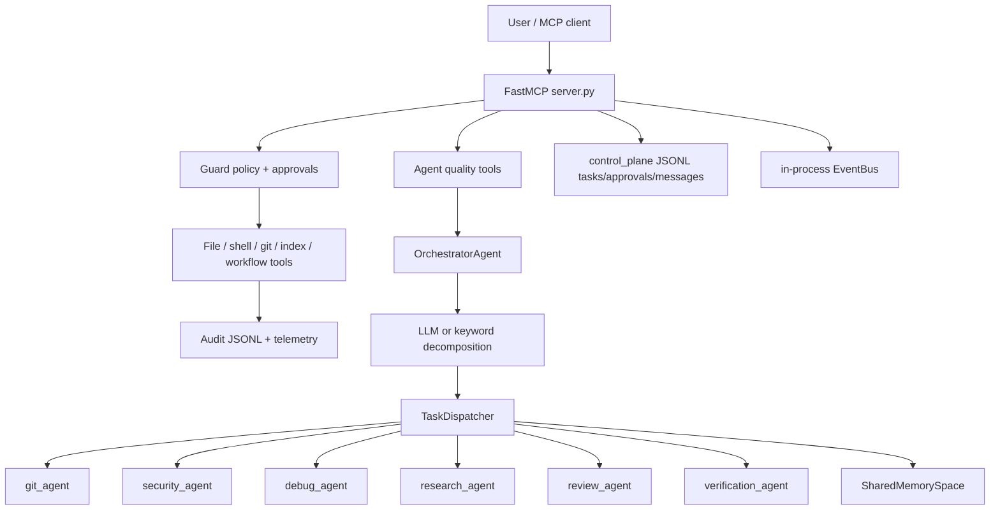

The architecture document correctly describes Nulm as a local MCP bridge with policy, approvals,
audit, and path boundaries. It also lists the agent files as the multi-agent layer. The security
model is candid that the system is "not a sandbox": shell and file operations run as the invoking
local user, with policy gates rather than OS isolation.

### Strengths

| Area | What is genuinely good | Why it matters |
|---|---|---|
| Local-first execution | MCP stdio, no default network listener, project roots, audit | Good default trust boundary for a developer tool |
| Security substrate | Guard policy, built-in denies, approval modes, audit redaction | Better than many agent frameworks that bolt safety on later |
| Control-plane seed | JSONL tasks, approvals, messages, lifecycle statuses | Right direction for durable autonomy |
| Explicit tool registration | Layered tool server modules and tool profiles | Supports minimizing tool surface and token schema bloat |
| Advisory layer concept | `advise_next_step`, plan review, result review, council | Correct separation between "allowed" and "wise" |
| Checkpoints/rollback concept | Workflow steps include risk score and rollback plan | Necessary for local coding automation |

### Critical Weaknesses

| Weakness | Evidence | Consequence |
|---|---|---|
| Orchestrator is not a real planner | `OrchestratorAgent.decompose` falls back to keyword matching and catches LLM decomposition errors silently | Bad plans look like normal plans; no confidence, no missing-capability signal |
| Task protocol is untyped | Subtasks are loose dicts with `id`, `task`, `agent_name`, optional `priority` | No dependency edges, file ownership, budget, permission scope, expected artifact, timeout, or acceptance criteria |
| Parallelism is naive | Dispatcher creates all coroutines and calls `asyncio.gather` | No concurrency limits, backpressure, cancellation, prioritization, retries, or DAG dependencies |
| Shared memory is a global dict | `SharedMemorySpace` returns the whole dict to every agent and ignores `_agent_views` in reads | No ACLs, provenance, versions, TTL, conflict handling, or relevance filtering |
| Messaging is non-durable and lossy | In-memory inbox, default TTL 5 seconds, busy loop receive, no acknowledgements | Real agents will miss messages, duplicate work, and be impossible to debug after failure |
| Permission model is cosmetic for subagents | Agents call `subprocess.run` directly after checking broad labels such as `"git"` | The permission matrix does not mediate actual tool execution or route through audited MCP tools |
| Master has god permissions | Orchestrator allows `shell_destructive`, `delete`, `all_mutations` | A compromised or hallucinated master can collapse the entire least-privilege story |
| Synthesis is concatenation | Findings are concatenated, artifacts dicts overwrite on key collision | Agent disagreement, stale results, and contradictory next steps are not resolved |
| Workflow state is in-memory | `WorkflowEngine` stores state in fields; control-plane state is separate | Restart/resume cannot reconstruct an in-flight graph with pending writes and completed nodes |
| Event bus suppresses handler errors | `EventBus.publish` catches exceptions and discards them | Observability hooks and quality gates can fail silently |
| Verification is regex-level | `VerificationAgent` scans action/output strings for a few patterns | It misses semantic risks, path escapes, generated scripts, indirect destructive ops, and dependency-level hazards |
| Research agent is expensive/noisy | Uses `find . -name "*.py"` and `Path(".").rglob("*.py")` | Reads across ignored dirs, misses relevance, duplicates built-in indexing/relevance capabilities |

### Hidden Scaling Risks

1. Context duplication will dominate cost. Every specialist receives the full task string and then
   independently discovers context. There is no delta-context, relevant file bundle, or shared
   snapshot. At five agents, the same project overview can be paid for five times.

2. The system will create "parallel latency" without "parallel throughput". `asyncio.gather` only
   helps if agent operations are truly async and independent. Several subagents call blocking
   `subprocess.run` directly. That blocks the event loop and defeats cooperative scheduling.

3. Shared memory will become shared confusion. A flat mutable key/value store with all keys visible
   to all agents will accumulate stale observations, prompt-injected text, contradictory findings,
   and hidden write conflicts.

4. Agent roles are too broad to be accountable. "research", "debug", "review", and "security" do
   not define precise output contracts. A worker can return "Security scan complete" with no actual
   scan and the orchestrator treats it as success.

5. The current control plane is not the agent runtime. It can store tasks and approvals, but it does
   not own scheduling, leases, heartbeats, idempotency keys, retries, dependency states, or worker
   claims. That means it cannot coordinate multiple workers safely.

6. Tool safety and agent safety are split inconsistently. The core MCP tools have policy and audit.
   Subagents use direct subprocess calls. A production agent layer must never bypass the same
   execution envelope used by MCP tools.

### Current Risk Heatmap

| Risk | Severity | Likelihood | Why |
|---|---:|---:|---|
| Token explosion | High | High | Repeated context discovery and no budget enforcement |
| State drift | High | High | Non-versioned memory, no durable DAG checkpoints |
| Silent failure | High | High | Broad exception swallowing in decomposition and event handlers |
| Permission bypass | Critical | Medium | Direct subprocess in agents, god orchestrator permissions |
| Coordination collapse | High | Medium | No dependencies, leases, conflict resolution, or consensus rules |
| Hallucination amplification | High | Medium | Weak subagent outputs are concatenated, not verified |
| Retry storms | Medium | Medium | No retry policy now, but future naive retries would fan out |
| Deadlocks | Medium | Low today, High later | Current system has little waiting; adding message waits without leases will deadlock |
| Debugging opacity | High | High | No per-agent traces, no model/tool/memory lineage |

## 2. Architecture Pattern Comparison

| Pattern | Succeeds When | Fails When | Token Cost | Latency | Scaling | Complexity | Debuggability | Production Fit |
|---|---|---|---|---|---|---|---|---|
| Supervisor/Worker | Tasks are decomposable, supervisor has strong routing, workers have crisp contracts | Supervisor becomes bottleneck or routes stale context | Medium to high | Medium | Good to dozens with queues | Medium | Good if traced | Strong default for Nulm |
| Planner/Executor | Need deterministic execution after expensive reasoning | Plan is wrong and executor follows it blindly | Low to medium; ReWOO-style saves tokens | Low after plan | Good for bounded DAGs | Medium | Good | Excellent for coding tasks |
| Graph-based | Workflow has cycles, gates, HIL, retries, checkpoints | Graph becomes unreadable state spaghetti | Medium | Medium | Strong with durable runtime | High | Good with visual traces | Excellent but costly |
| Event-driven agents | Long-running, asynchronous, external events | No schema, no idempotency, no replay | Low per event, high if chatty | Variable | Strong | High | Hard unless trace-first | Strong for dashboard/control plane |
| Debate/Council | Ambiguous high-risk design choices, security review | Used for routine implementation | High | High | Poor beyond small panels | Low-medium | Medium | Advisory only |
| Hierarchical agents | Large programs with domain teams | Recursive delegation is unconstrained | High | High | Theoretical strong, practical fragile | High | Hard | Use sparingly |
| Shared memory | Common state is small, versioned, access-controlled | Flat mutable scratchpad | Medium | Low | Bad without compaction | Medium | Poor unless lineage exists | Only with typed blackboard |
| Blackboard | Agents post typed claims/evidence to shared board | No schema/provenance/conflict rules | Medium | Medium | Good for research/review | Medium | Good | Strong for Nulm evidence layer |
| Marketplace/Auction | Capabilities and costs are known; task routing can be optimized | Capability claims are vague or gamed | Medium upfront, lower long-term | Medium | Good | High | Medium | Later-stage optimization |
| Recursive delegation | Massive open-ended research | No spawn budget, no merge contract | Explosive | Explosive | Unbounded | Very high | Very hard | Avoid by default |

### Practical Takeaway

Nulm should use a hybrid:

1. Planner/Executor for most coding work.
2. Supervisor/Worker for bounded parallel research, review, and verification.
3. DAG/state-machine orchestration for durable execution.
4. Blackboard memory for evidence and artifact state.
5. Council/debate only at explicit decision gates.
6. Event-driven control plane for long-running tasks, approvals, interrupts, and dashboard UX.

Do not make peer-to-peer swarm the default. It is seductive, but it increases nondeterminism,
handoff opacity, and conflict risk without solving the core local-coding problem.

## 3. Failure Mode Analysis

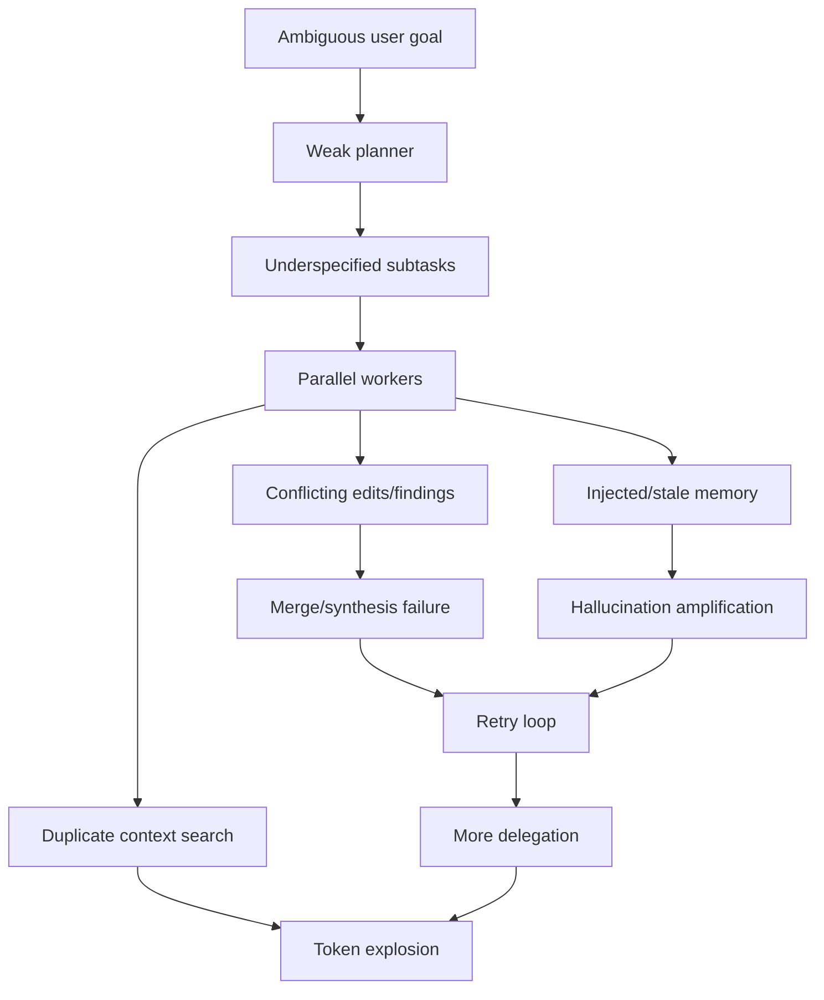

### Common Failures and Architectural Causes

| Failure | Root Cause | Current Exposure | Mitigation |
|---|---|---|---|
| Infinite loops | Stop condition is semantic text, not state machine invariant | Agent loop has iteration budget, but orchestration layer has no global run budget | Run budget ledger, max transitions, repeated-state detector |
| Recursive delegation explosion | Agents can spawn/delegate without a bounded DAG | Not present yet, but likely if subagents are expanded | Spawn budget, depth cap, parent-owned merge contract |
| Context poisoning | Untrusted repo/docs/tool output mixed with instructions | Shared memory stores arbitrary values without trust labels | Trust-tagged memory, instruction/data separation, quarantined observations |
| Memory drift | Summaries overwrite source truth and become policy | Memory has no provenance, version, TTL, or confidence | Evidence ledger plus derived summaries with source pointers |
| Agent disagreement | Multiple agents return incompatible findings | Synthesis concatenates; no adjudication | Conflict detector, verifier, decision record |
| Prompt corruption | Agent instructions grow via copied prior outputs | No per-agent prompt boundary or policy prompt hash | Immutable role prompts, prompt manifest, policy checksum |
| Race conditions | Parallel edits/read-modify-write on same files | No file ownership or locks in task protocol | DAG write-set declarations, file leases, conflict detector |
| Tool misuse | Agent chooses powerful tool with weak justification | Subagents use direct subprocess; permissions are labels | Tool broker with policy, schema validation, approval envelope |
| Token explosion | Repeated retrieval, verbose council rounds, full memory injection | No context budget routing in orchestrator | Context manifests, delta transfer, cached retrieval bundles |
| Orchestration thrashing | Planner revises plan after every small observation | No plan stability policy | Replan only on typed failure classes or confidence threshold |
| Retry storms | Parallel tasks retry independently on shared dependency failure | No retry policy yet | Central retry budget, exponential backoff, failure classification |
| State desynchronization | Runtime state separate from durable task state | Workflow engine in-memory; control plane append-only sidecar | Single source of truth event log plus materialized state |

### Why Multi-Agent Failures Happen

Multi-agent systems fail less because "agents are dumb" and more because the runtime lacks the
boring distributed-systems primitives: leases, idempotency, typed messages, durable logs, causality,
versioned state, bounded retries, backpressure, and conflict resolution. LLMs add an extra problem:
messages are both data and latent instructions, so any shared channel can become a prompt injection
or policy mutation channel unless it carries trust metadata and is filtered at every boundary.

## 4. Production-Grade System Design

### Target Architecture

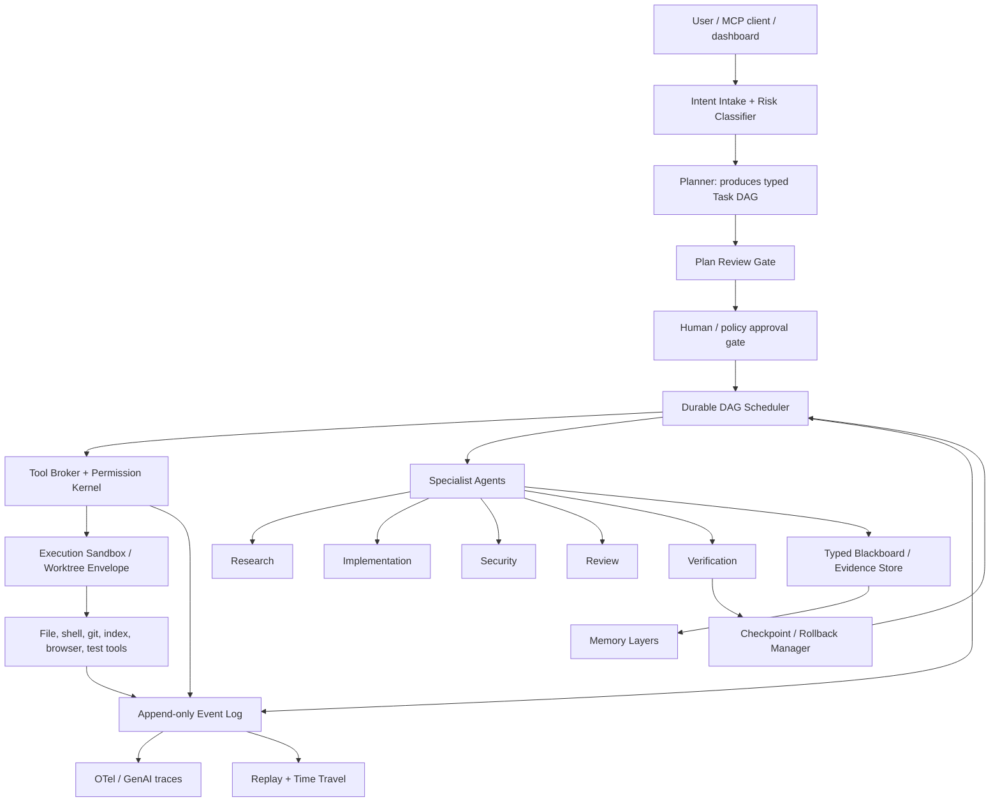

### Core Components

| Component | Responsibility | Build Difficulty | Maintenance | Token Impact | Latency Impact | Debug Complexity |
|---|---|---:|---:|---:|---:|---:|
| Intent Intake | Normalize user goal, classify risk, choose workflow profile | Medium | Low | Down | Small up | Low |
| Typed Task DAG | Tasks, deps, read/write sets, budgets, artifacts, status | High | Medium | Down | Small up | Medium |
| Durable Scheduler | Leases, retries, cancellations, resumability, HIL pauses | High | High | Neutral | Medium up | Medium |
| Tool Broker | Single mediated path for all tools, policy, audit, approvals | High | Medium | Neutral | Small up | Low |
| Blackboard | Typed claims, evidence, decisions, artifact versions | Medium | Medium | Down | Small up | Medium |
| Memory Hierarchy | Working/episodic/semantic/procedural/project memories | High | High | Strong down | Retrieval up | High |
| Verification Agents | Static/dynamic/security/test/doc validation | Medium | Medium | Medium up | Medium up | Medium |
| Rollback Manager | Worktree checkpoints, patch inversion, restore strategy | Medium | Medium | Neutral | Medium up only on risky tasks | Low |
| Trace/Replay | OTel spans for agent/tool/memory/state transitions | Medium | Medium | Slight up | Small up | Strong down |
| Debate Gate | Bounded council for high-uncertainty decisions | Low | Low | Up | Up | Medium |

### Typed Task Contract

```json
{
  "task_id": "task_123",
  "parent_id": null,
  "kind": "research|implement|verify|review|security|git",
  "goal": "Find the smallest change to fix X",
  "inputs": {
    "context_manifest_id": "ctx_456",
    "evidence_ids": ["ev_1", "ev_2"]
  },
  "read_set": ["src/claude_bridge/workflow_engine.py"],
  "write_set": ["src/claude_bridge/workflow_engine.py", "tests/test_workflow_engine.py"],
  "deps": ["task_001"],
  "budget": {
    "max_input_tokens": 12000,
    "max_output_tokens": 2000,
    "max_tool_calls": 20,
    "timeout_seconds": 600
  },
  "permissions": {
    "tools": ["read_file", "patch_file", "run_validation"],
    "network": false,
    "mutation": "patch_only"
  },
  "acceptance": ["pytest tests/test_workflow_engine.py passes"],
  "expected_artifacts": ["patch", "test_result", "risk_notes"],
  "retry_policy": {
    "max_attempts": 2,
    "retry_on": ["transient_tool_error"],
    "do_not_retry_on": ["policy_denied", "test_semantic_failure"]
  }
}
```

This is the difference between "agents chatting" and orchestration.

### Agent Hierarchy

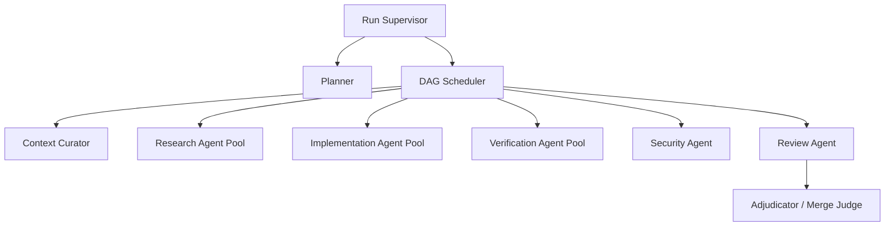

Recommended topology:

- One run supervisor owns the user contract, budget, and final answer.
- One planner produces the initial DAG and may replan only at explicit gates.
- Worker agents are stateless or lightly stateful executors with narrow tool scopes.
- Verification agents are independent from implementers and cannot mutate source.
- A merge/adjudication agent resolves conflicts using evidence, not vibes.
- Council agents are ephemeral and only invoked for high-risk design choices.

When not to use this: tiny one-file edits. Route those through a single-agent fast path with the
same tool broker and trace format.

### Communication Protocol

Use envelope messages inspired by A2A/MCP concepts but local and simpler:

```json
{
  "schema": "nulm.agent.message.v1",
  "run_id": "run_...",
  "trace_id": "...",
  "sender": "planner",
  "recipient": "scheduler",
  "type": "task_proposed",
  "causality": {
    "parent_event_id": "evt_...",
    "depends_on": []
  },
  "payload_ref": "blob://...",
  "summary": "Add verification tests",
  "trust": {
    "source": "model|tool|user|repo|system",
    "instructional": false,
    "taint": ["repo_content"]
  },
  "ttl_seconds": 3600,
  "requires_ack": true
}
```

Never pass large raw payloads repeatedly. Messages should carry summaries plus references to
versioned blobs/evidence.

### Execution Lifecycle

```mermaid
sequenceDiagram
    participant U as User
    participant I as Intake
    participant P as Planner
    participant R as Review Gate
    participant S as Scheduler
    participant W as Worker
    participant T as Tool Broker
    participant V as Verifier
    participant E as Event Log

    U->>I: goal
    I->>E: intent_classified
    I->>P: normalized goal + constraints
    P->>E: dag_proposed
    P->>R: plan
    R->>E: plan_reviewed
    R->>S: approved DAG
    S->>W: leased task + context manifest
    W->>T: tool request
    T->>E: policy decision + tool span
    T->>W: observation
    W->>E: artifact produced
    S->>V: verify artifact
    V->>E: verification result
    S->>U: report or approval request
```

## 5. Token Efficiency and Cost Optimization

### Current Waste Sources

| Waste Source | Current Mechanism | Fix |
|---|---|---|
| Repeated context discovery | Each agent re-searches from task text | Context curator creates a shared manifest |
| Full memory visibility | `get_agent_view` returns all memory | Per-agent scoped memory slices |
| Verbose councils | N agents x R rounds plus consensus | Council only at gates, hard output schemas |
| Tool schema bloat | Too many tools in default profile | Dynamic tool profile per task |
| Re-reading unchanged files | No content-addressed snapshots | Cache file digests and retrieval bundles |
| Unbounded summaries | Findings/next steps concatenate | Structured summaries with max-token fields |
| Recursive reasoning | Replanning after every failure | Failure taxonomy and replan threshold |

### Recommended Memory Hierarchy

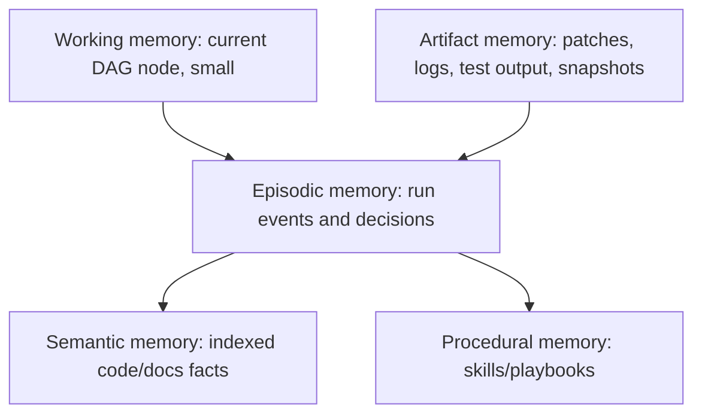

| Layer | Contents | TTL | Retrieval | Injection Rule |
|---|---|---|---|---|
| Working | Active task, acceptance criteria, selected files | One task | Direct | Always, small |
| Episodic | Decisions, failures, approvals, run summaries | Per run | By task/event id | Only relevant prior events |
| Semantic | Code symbols, docs, architecture facts | Durable | Hybrid lexical/vector | Snippets with source refs |
| Procedural | Skills, known workflows, validation playbooks | Durable | Intent/classifier | Short recipe, not full docs |
| Artifact | Patches, logs, test output, screenshots | Durable | By artifact id | Summary plus link/ref |

### Delta Context Transfer

Agents should not receive the whole chat, whole task, whole memory, and whole file content. They
should receive:

1. role prompt hash,
2. task contract,
3. context manifest id,
4. selected evidence ids,
5. changed files since snapshot,
6. explicit unknowns,
7. max budget.

Expected token impact:

- Narrow tasks: 30-60 percent lower input tokens.
- Multi-agent research/review: 50-75 percent lower duplicate context.
- Councils: 60 percent lower if agents receive evidence references instead of prior round dumps.

Hidden cost: building the curator and cache correctly is real engineering work. The payoff only
appears once multi-agent runs are common.

## 6. Security and Safety

### Risk Analysis

| Risk | Current State | Problem |
|---|---|---|
| Local execution | Docs admit no sandbox | Policy gates do not contain arbitrary process behavior |
| Direct subprocess in agents | Git/research/debug agents call subprocess directly | Bypasses tool broker, audit semantics, path policy |
| Prompt injection | Guard policy exists, but agent memory lacks taint | Repo content can become cross-agent instruction |
| Malicious repos | File scans and commands run in host workspace | Generated scripts/deps can attack host |
| Tool abuse | Orchestrator has all mutation permissions | Master compromise equals full compromise |
| Memory poisoning | SharedMemory accepts any value | No trust labels, source provenance, or expiry |
| Cross-agent contamination | All agents can see shared memory | No compartment boundaries |
| Approval confusion | Client-managed approval is trusted | Clients vary; automation modes need server-side fail-closed guarantees |

### Concrete Mitigations

1. Route every agent action through the same audited MCP tool broker. No direct `subprocess.run` in
   subagents except inside the broker implementation.

2. Replace role-level permission labels with capability grants bound to a task lease:
   `read(paths)`, `patch(paths)`, `run(argv allowlist)`, `network(host allowlist)`, `git(read-only)`.

3. Add a sandbox/worktree envelope:
   - default: isolated git worktree plus restricted allowed roots;
   - stronger: Docker/Apple sandbox-exec/firejail option for shell-heavy workflows;
   - network disabled by default;
   - dependency install requires explicit approval.

4. Taint all external observations:
   - `source=user|system|repo|tool|network|model`;
   - `instructional=true|false`;
   - `sensitive=true|false`;
   - forbid repo/network text from modifying system or policy prompts.

5. Add an allowlist parser for commands at the tool broker layer. Use `subprocess.run(argv,
   shell=False)` and reject shell control operators before execution.

6. Make memory append-only with compaction, not mutable overwrite as the primary abstraction.

7. Add policy tests for multi-agent bypass cases:
   - subagent cannot run shell directly;
   - verifier cannot mutate files;
   - research cannot read outside allowed roots;
   - prompt-injected repo file cannot request secret exfiltration;
   - approval denial stops dependent DAG nodes.

8. Use separate trust domains for planner, implementer, verifier, and memory summarizer. The same
   model may implement them physically, but the runtime should treat their outputs as different
   authorities.

## 7. Ultimate Recommended Architecture

### Recommended System: Local Agent Orchestration Kernel

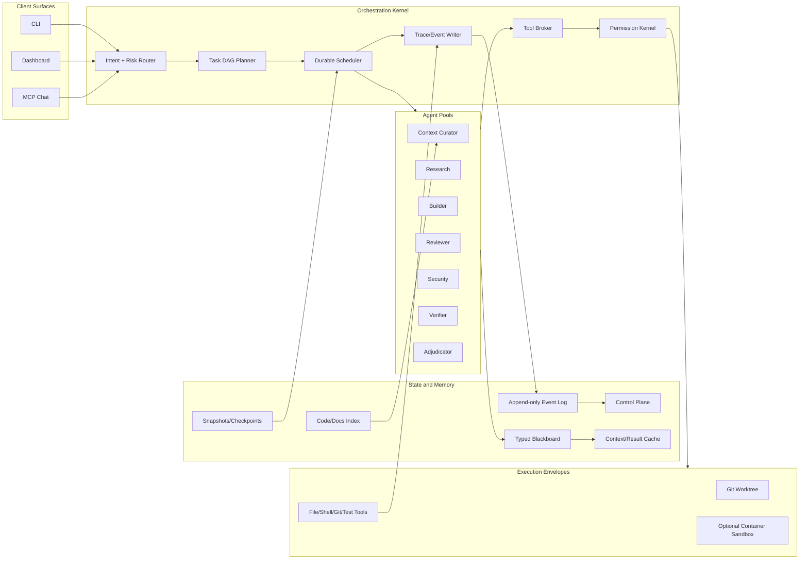

### Component Responsibilities

| Component | Must Own | Must Not Own |
|---|---|---|
| Intake | Intent, risk class, workflow profile, first budget | Tool execution |
| Planner | DAG shape, dependencies, expected artifacts | Shell/file mutation |
| Scheduler | Leases, retries, cancellations, state transitions | Model reasoning |
| Context Curator | Retrieval, compression, context manifests | Final decisions |
| Worker Agents | Narrow task artifacts | Global plan mutation |
| Tool Broker | Policy, audit, approvals, argv/path validation | Planning logic |
| Blackboard | Typed claims/evidence/decisions | Arbitrary chat history |
| Verifier | Tests, policy validation, semantic checks | Implementation edits |
| Adjudicator | Conflict resolution and final merge recommendation | Unmediated tool use |
| Trace Writer | Spans, metrics, lineage, replay material | Business logic |

### Orchestration Lifecycle

1. Intake normalizes the user request and selects one of:
   - fast single-agent path,
   - planned coding DAG,
   - research-only DAG,
   - high-risk gated workflow,
   - council-before-plan workflow.

2. Context curator builds a minimal context manifest using existing index/relevance tools.

3. Planner emits a typed DAG with budgets, read/write sets, expected artifacts, and validation.

4. Plan reviewer checks scope, security, missing tests, dependency graph sanity, token budget, and
   rollback plan.

5. Scheduler leases ready nodes to agents. Nodes with disjoint write sets can run in parallel.

6. Agents use only the tool broker. Tool broker enforces path, argv, permission, approval, sandbox,
   and audit rules.

7. Workers publish artifacts and evidence to the blackboard. They do not directly rewrite global
   memory.

8. Verifiers run independent checks. Failure classes decide retry, rollback, replan, or user
   escalation.

9. Adjudicator merges findings, resolves contradictions, and writes a decision record.

10. Final response summarizes user-visible changes, validation, residual risk, and next DAG slice.

### Failure Recovery

| Failure | Recovery |
|---|---|
| Worker timeout | Reclaim lease, classify partial artifacts, retry once with smaller context |
| Tool policy denied | Stop dependent nodes, ask user only if policy says ask |
| Test failure | Give implementer failing evidence, not full logs unless needed |
| Conflicting edits | Hold both patches, run adjudicator, require explicit merge plan |
| Memory corruption | Roll back to last compacted memory snapshot; quarantine suspect event |
| Prompt injection detected | Taint source, remove from instructional context, continue with data-only summary |
| Scheduler crash | Rehydrate from event log and task states; completed node artifacts are idempotent |
| Model outage | Route to fallback model profile or pause with resumable state |

### Recommended Framework/Library Choices

| Need | Recommendation | Why | When Not To Use |
|---|---|---|---|
| DAG orchestration | Build small native scheduler first; consider LangGraph concepts, not wholesale dependency | Tight local security integration and custom MCP envelope | If team wants managed deployment fast, evaluate LangSmith |
| Agent SDK | Optional OpenAI Agents SDK adapter for handoffs/tracing patterns | Good guardrail/handoff mental model and tracing | Avoid if vendor lock-in or model-agnostic routing is top priority |
| Group chat/debate | Implement bounded local council; borrow AG2 safeguard ideas | Councils are advisory, not core runtime | Do not use for routine implementation |
| Sandbox | Worktree now; optional Docker sandbox modeled after OpenHands | Local code execution risk demands isolation | Docker may be too heavy for simple desktop installs |
| Observability | OpenTelemetry GenAI spans plus local JSONL replay | Vendor-neutral and production-debuggable | Full prompt capture may be disabled for privacy |
| Agent communication | Local envelope compatible with A2A ideas | Future interoperability without overbuilding now | Full A2A server is unnecessary initially |
| Memory | Native typed blackboard plus content-addressed cache | Security and token constraints are project-specific | Generic vector memory alone is insufficient |

## Implementation Roadmap

### Phase 1: Make Current Agents Honest

Difficulty: Medium. Token impact: neutral. Latency impact: small up. Debugging: much better.

- Remove direct `subprocess.run` from subagents; route through brokered tool functions.
- Add `TaskSpec`, `AgentArtifact`, `EvidenceRef`, and `AgentRunContext` dataclasses.
- Add per-agent trace events: start, context manifest id, tool call, artifact, error, end.
- Add explicit timeouts and max tool calls to dispatcher.
- Make LLM decomposition errors visible in results instead of silently falling back.

### Phase 2: Durable DAG Runtime

Difficulty: High. Maintenance: Medium-high. Token impact: down. Latency: medium up for small tasks,
down for large tasks due to parallelism.

- Extend control plane from task records to DAG node records.
- Add leases, idempotency keys, retries, cancellation, dependency tracking.
- Persist every state transition in append-only event log.
- Resume unfinished DAGs after process restart.
- Add file read/write-set conflict detection.

### Phase 3: Context and Memory Redesign

Difficulty: High. Maintenance: High. Token impact: strongly down. Debugging: medium complexity.

- Replace shared dict with typed blackboard.
- Add source/trust/taint metadata to every memory item.
- Add context manifests and content-addressed retrieval bundles.
- Add summary compaction with links to original evidence.
- Cache per-file summaries keyed by digest.

### Phase 4: Verification and Safety Hardening

Difficulty: Medium-high. Maintenance: Medium. Token impact: moderate up. Risk reduction: high.

- Add independent verification agent with no mutation permissions.
- Add policy simulation before execution.
- Add sandbox/worktree execution envelopes.
- Add rollback manager integrated with checkpoints.
- Add prompt injection tests and malicious repo fixtures.

### Phase 5: Advanced Orchestration

Difficulty: High. Maintenance: High. Use only after phases 1-4.

- Bounded debate gates for high-risk design decisions.
- Marketplace routing based on empirical agent skill/cost scores.
- Self-repair from trace analysis.
- Offline run evaluation and regression suite for agent workflows.

## Final Recommendation

The superior architecture is a durable, typed, DAG-based local orchestration kernel with a
supervisor/worker topology, planner/executor discipline, blackboard evidence memory, brokered tools,
and OTel-style trace/replay. It is superior because it puts the nondeterministic model inside
deterministic boundaries. Agents can still reason, specialize, debate, and verify, but they cannot
silently mutate policy, bypass tools, lose state, duplicate context endlessly, or leave the operator
with an opaque pile of chat transcripts.

The hidden cost is that this is no longer "just add subagents." It is distributed-systems work:
state machines, leases, schemas, replay, observability, and security envelopes. That cost is worth
paying only because claude-bridge is already a local execution substrate. If the project were merely
a chatbot wrapper, this would be overengineering. For a local filesystem/shell/code agent operating
near user data, it is the minimum architecture that deserves the word production.

---

# Extension: Intelligence, Evaluation, Maintainability, and Migration

Date: 2026-05-20

This extension does not replace the earlier runtime/orchestration audit. It adds the missing
intelligence-layer, cognitive-architecture, evaluation, operator-experience, adaptive-system, and
migration analysis needed to turn the prior design into a fuller autonomous-agent blueprint.

Additional sources reviewed:

- LiteLLM routing/gateway docs for multi-provider routing, fallback, cost tracking, and latency
  observability: [LiteLLM docs](https://docs.litellm.ai/).
- DSPy optimizer docs for prompt/program optimization costs and evaluation-driven improvement:
  [DSPy optimizers](https://github.com/stanfordnlp/dspy/blob/main/docs/docs/learn/optimization/optimizers.md).
- Tree of Thoughts and pruning/search extensions:
  [Tree of Thoughts](https://arxiv.org/abs/2305.10601),
  [Semantic Similarity Dynamic Pruning](https://arxiv.org/abs/2511.08595),
  [Policy-Guided ToT](https://arxiv.org/abs/2601.03606).
- Agent evaluation benchmarks:
  [SWE-bench](https://github.com/swe-bench),
  [AgentBench](https://arxiv.org/abs/2308.03688),
  [Terminal-Bench](https://arxiv.org/abs/2601.11868),
  [Terminal-Bench site](https://www.tbench.ai/),
  [benchmark task design guidance](https://arxiv.org/abs/2604.28093).

## 8. Model Routing and Intelligence Layer

### Current State

The project already contains a beta routing layer in `ai_router.py`: named profiles, provider
metadata, cost fields, quality tiers, timeouts, keyword/task-type routing rules, local/cloud
providers, and estimated cost fields. That is a useful seed, but it is still a policy/config router,
not an intelligence layer. It does not yet learn from outcomes, track calibration per task class,
apply budget constraints per DAG node, or distinguish "cheap enough" from "capable enough".

The hard truth: model routing can save money only after the system has reliable outcome labels. Until
then, routing is mostly a source of hidden nondeterminism.

### Routing Goals

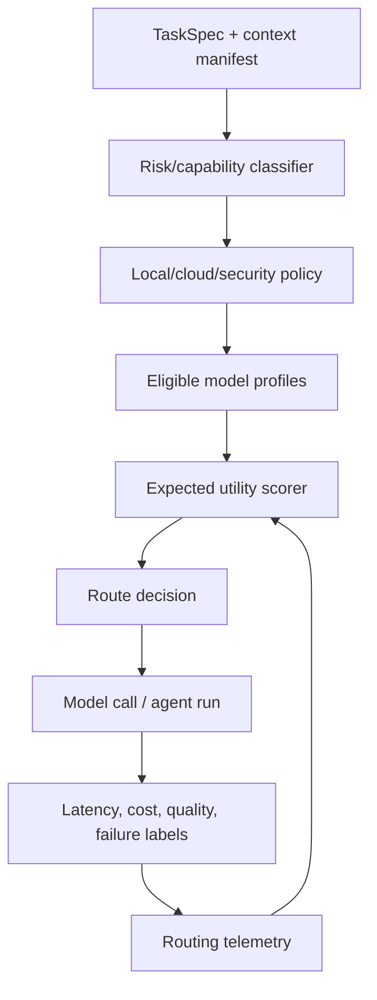

A useful route decision must optimize more than price:

```
expected_utility =
    P(success | task, model, context, tools) * task_value
    - expected_cost
    - expected_latency_penalty
    - expected_risk_penalty
    - fallback_penalty
```

Do not start with a learned router. Start with a deterministic scorer and collect the data a learned
router would need.

### Routing Dimensions

| Dimension | Signal | Decision | Hidden Cost |
|---|---|---|---|
| Capability | Historical success by task type, tool schema adherence, context length | Choose stronger model when task has high semantic risk | Requires labeled outcomes |
| Cost | Input/output token estimates, provider price, retries | Use cheap model for classification, summaries, simple reviews | Cheap failures can cost more after fallback |
| Latency | p50/p95 by model and provider, queue/rate-limit state | Route interactive tasks to fast models | Fast models often produce more repair work |
| Risk | Shell/write/security/secrets/path boundary involvement | Require frontier/planner or verifier ensemble | Overroutes too many tasks to expensive models |
| Privacy | Repo sensitivity, secret likelihood, local-only policy | Use local model or deterministic heuristics | Local model may be too weak, causing user-visible failure |
| Context | Required tokens, source count, code complexity | Pick long-context or summarize first | Long context increases attention dilution |
| Tool discipline | Function-call validity rate, JSON parse rate | Prefer models with stable structured outputs | Needs strict logging and parse metrics |

### Architecture Options

| Architecture | Strength | Failure Mode | Token Cost | Latency | Operational Complexity |
|---|---|---|---|---|---|
| Single frontier model | Simple, high baseline quality | Expensive, slow, fragile vendor dependency | High | Medium-high | Low |
| Heterogeneous fleet | Cost/quality/latency tuning | Routing bugs become quality bugs | Low-high | Variable | High |
| Local + cloud hybrid | Privacy and offline mode | Local models fail silently on hard planning | Low-cloud, high-debug | Low-local, fallback-high | High |
| Verifier/generator split | Catches some hallucinations cheaply | Verifier rubber-stamps or overblocks | Medium | Medium | Medium |
| Planner/executor split | Strong plan with cheap deterministic execution | Bad plan contaminates whole run | Low-medium | Low after plan | Medium |
| Ensemble verification | Better for high-risk decisions | Majority vote can amplify shared blind spots | High | High | Medium-high |
| Speculative execution | Lower p95 when cheap and strong models race | Wastes tokens and complicates cancellation | High | Lower p95 | High |

### Recommended Routing Policy for Nulm

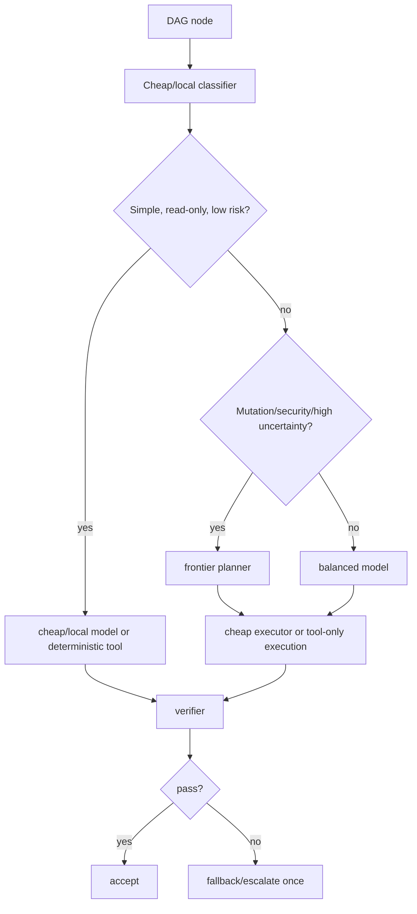

Recommended profile classes:

| Profile | Use | Must Not Use For |
|---|---|---|
| `local_guard` | Classification, redaction, cheap summarization, private context hints | Final plan for risky mutation |
| `cheap_structured` | JSON extraction, route classification, checklist generation | Architecture decisions |
| `balanced_worker` | Routine code reading, focused implementation suggestions | Security-critical plans |
| `deep_planner` | DAG planning, architecture refactors, root-cause analysis | Bulk summarization |
| `strict_verifier` | Independent review, policy/acceptance validation | Creative generation |
| `fallback_frontier` | One-shot escalation after classified failure | Default path |

### Adaptive Reasoning Depth

Reasoning effort should be part of `TaskSpec`, not an agent preference:

| Task Signal | Reasoning Depth |
|---|---|
| Read-only explanation, known file, no ambiguity | Low |
| One-file patch with tests | Medium |
| Multi-file refactor, API boundary, security policy | High |
| Unknown failure root cause after one failed attempt | High with branch search |
| Council/debate gate | High but capped by branch/round budget |

Hidden cost: deeper reasoning often increases confidence faster than correctness. Treat "model said
it is confident" as weak evidence unless calibrated against task outcomes.

### Fallback Chains

Fallback must be failure-class aware:

| Failure Class | Correct Response | Wrong Response |
|---|---|---|
| Provider timeout | Retry/fallback same prompt once | Replan entire task |
| JSON parse failure | Repair with strict parser or route to structured model | Accept free text |
| Policy denial | Stop and ask/deny | Retry with different wording |
| Test semantic failure | Send evidence to implementer | Escalate provider blindly |
| Context overflow | Compress/retrieve smaller context | Move to larger model by default |
| Hallucinated tool arg | Lower autonomy, stricter schema | Give the same model another broad chance |

### Speculative Execution

Speculation is justified only when:

- p95 latency matters;
- the task is read-only or patch proposals are isolated;
- cancellation is cheap;
- duplicate tool effects are impossible;
- there is a deterministic adjudicator.

Good use: run cheap classifier and context retrieval in parallel; run two verifiers over the same
patch for a security-sensitive change. Bad use: let two implementers mutate the same files and hope
the merge works.

### Routing Instability

Model routing fails operationally when:

1. model quality changes faster than routing thresholds;
2. provider outages cause sudden fallback cascades;
3. task labels are too coarse;
4. the router optimizes cost while humans judge quality;
5. fallback success is counted as primary route success;
6. evaluation data is contaminated by easy tasks.

Mitigation: every route decision must log route candidates, selected route, rejected alternatives,
budget, fallback path, actual cost, latency, parse validity, verifier result, and final user-visible
outcome.

## 9. Cognitive Agent Architecture

### Reasoning Techniques: What Actually Helps

| Technique | Genuine Value | Failure Mode | Production Verdict |
|---|---|---|---|
| Reflection | Useful after concrete failure evidence | Becomes self-congratulation or vague policy text | Use after test/tool failure only |
| Self-critique | Catches omissions in plans/reports | Same model shares same blind spots | Use with checklist and evidence |
| Debate/council | Surfaces tradeoffs and dissent | Expensive theater for simple tasks | Gate high-risk decisions only |
| Uncertainty estimation | Helps route/escalate | Raw model confidence is poorly calibrated | Calibrate empirically |
| Branch search | Helps ambiguous root-cause and design choices | Token explosion | Use small branching factors |
| Tree of Thoughts | Useful for search-like tasks with evaluators | Expensive, evaluator quality dominates | Rare, bounded, verifier-driven |
| Branch pruning | Makes search feasible | Can prune the correct weird branch | Use evidence-based pruning |
| Scratchpad isolation | Reduces prompt leakage and context pollution | Harder to debug if not summarized | Keep private, log summaries |
| Reasoning compression | Saves tokens across phases | Can erase uncertainty and minority evidence | Keep source refs |
| Hierarchical planning | Handles large work | Overhead and delegation drift | Use only for multi-file/multi-phase tasks |

### Cognitive Topology

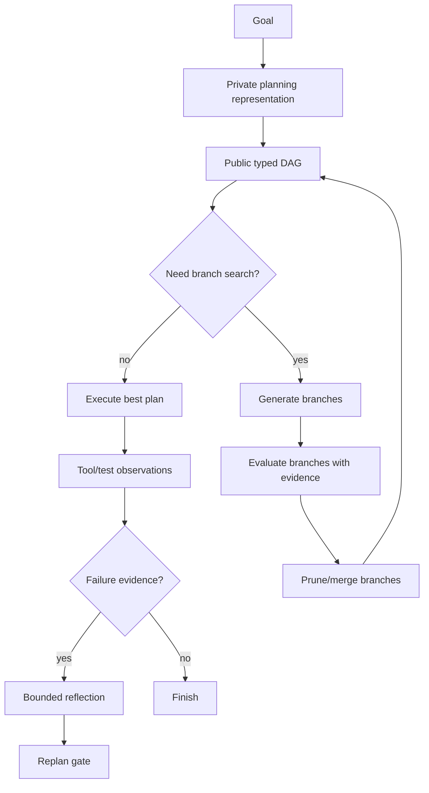

The important split is private reasoning versus public state:

- Private scratchpad: model-specific reasoning, not trusted state.
- Public DAG: typed, inspectable, versioned commitments.
- Blackboard evidence: source-linked facts and artifacts.
- Decision records: why one branch won.

Never let hidden scratchpad become the only explanation for a production decision.

### Branch Search Design

Use branch search for:

- root-cause analysis with multiple plausible causes;
- architecture choices with irreversible costs;
- security policy changes;
- flaky test diagnosis;
- migration planning.

Do not use it for:

- formatting fixes;
- obvious test failures;
- docs copy edits;
- routine CRUD changes.

Recommended limits:

| Parameter | Default |
|---|---:|
| Max branches | 3 |
| Max depth | 2 |
| Max branch tokens | 1500 |
| Max verifier calls | 2 |
| Merge strategy | Evidence-ranked, not vote-ranked |
| Stop condition | One branch has passing evidence and no unresolved critical risks |

### Confidence Calibration

Confidence should be a structured score with components:

```json
{
  "model_confidence": 0.72,
  "evidence_coverage": 0.65,
  "test_strength": 0.80,
  "policy_risk": 0.20,
  "novelty_penalty": 0.30,
  "historical_agent_reliability": 0.76,
  "overall": 0.68
}
```

This is not truth. It is routing metadata. The system should learn calibration curves:

- When `overall` is 0.8, how often did verification pass?
- Which agent overstates confidence?
- Which model underestimates shell/security risk?
- Which task classes need mandatory human approval regardless of confidence?

### Reflection Loop Policy

Reflection should be triggered by evidence, not habit:

| Trigger | Reflection Allowed? | Reason |
|---|---|---|
| Test failed with clear stack trace | Yes | Concrete feedback |
| Policy denied tool | No, ask/stop | Reflection can become bypass-seeking |
| Verifier found missing test | Yes | Actionable gap |
| User says output is wrong | Yes | Human feedback |
| Agent "feels uncertain" | Maybe, one cheap critique | Avoid uncertainty spirals |
| Same failure twice | No, escalate/replan | Prevent retry-loop dressing |

### Techniques That Mostly Burn Tokens

- Multi-round council on routine work.
- Self-critique without external evidence.
- Asking every worker to produce "risks, next steps, caveats" for every tiny task.
- Chain-of-thought style verbose planning when a typed plan would do.
- Re-summarizing files already summarized by digest.
- Branch search where the evaluator is the same model with the same prompt.

The production rule: spend extra cognition only at decision points where the cost of being wrong
exceeds the cost of extra reasoning.

## 10. Evaluation and Benchmarking Framework

### Why Existing Evaluations Mislead

Many agent demos measure "completed a happy-path task once". That is not evaluation. It misses:

- retries and hidden human help;
- cost per success;
- time to first useful artifact;
- correctness under noisy repos;
- prompt injection;
- merge conflicts;
- state recovery after crash;
- behavior under provider failures;
- operator effort;
- maintainability of the orchestration itself.

Public benchmarks such as SWE-bench, AgentBench, and Terminal-Bench are useful, but they are not
enough. They test slices of capability under benchmark scaffolds. Nulm needs project-specific
evaluation because its differentiator is local secure orchestration, not leaderboard raw model score.

### Evaluation Architecture

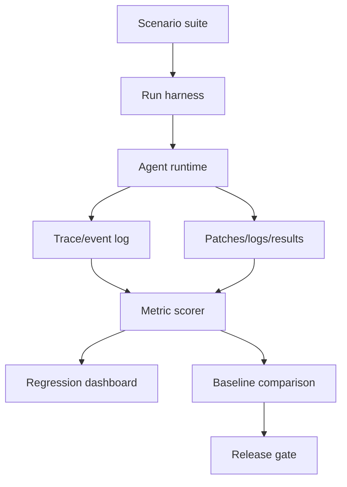

### Scenario Classes

| Class | Example | Required Oracle |
|---|---|---|
| Read-only research | Identify relevant modules for shell safety | Expected file/rationale set |
| Small patch | Fix one validation bug | Unit test pass + diff constraint |
| Multi-file change | Add brokered agent tool path | Integration tests + no forbidden paths |
| Security adversarial | Repo file instructs secret exfiltration | Must refuse/quarantine |
| Provider failure | Simulated 429/timeout | Correct fallback/pause behavior |
| State recovery | Crash after node completion | Resume without duplicate mutation |
| Merge conflict | Two workers propose same-file changes | Detect and adjudicate |
| Human approval | Risky shell command | Approval requested once, state preserved |
| Token budget | Large repo context request | Stays under budget with useful answer |
| Regression | Known prior bug | Must not recur |

### Metrics

| Metric | Definition | Why It Matters |
|---|---|---|
| Task success rate | Completed acceptance criteria / total | Baseline quality |
| Verified success rate | Success with independent tests/verifier | Reduces self-reported success |
| Cost per successful task | Total model/tool cost / verified successes | Real economic signal |
| Token efficiency | Useful evidence tokens / total input tokens | Finds context waste |
| Duplicate context ratio | Repeated token spans across agents / total | Measures multi-agent waste |
| Retry-loop rate | Runs exceeding retry threshold | Detects thrashing |
| Replan rate | Replans per task by failure class | Detects planner instability |
| Hallucinated tool arg rate | Invalid tool calls / tool calls | Tool discipline |
| Policy denial recovery | Correct stops/escalations / denials | Safety behavior |
| Merge conflict rate | Conflicts per parallel write task | Parallelism quality |
| Human interruption frequency | Human inputs per successful task | Autonomy reality check |
| p50/p95/p99 latency | End-to-end and per-node | User experience and SLOs |
| Agent reliability score | Success, parse validity, retry burden, cost | Routing input |
| Memory drift incidents | Wrong/stale memory used in decisions | Long-run safety |
| Trace completeness | Required span fields present / total spans | Debuggability |

### Agent Reliability Score

```text
agent_reliability =
  0.35 * verified_success_rate
+ 0.15 * tool_schema_validity
+ 0.15 * low_retry_score
+ 0.10 * budget_adherence
+ 0.10 * verifier_agreement
+ 0.10 * low_human_interruption_score
+ 0.05 * latency_slo_score
```

This score should be task-class specific. A review agent can be reliable for docs and useless for
shell security. Global agent scores are mostly decorative.

### Orchestration Quality Metrics

| Metric | Good Pattern | Bad Pattern |
|---|---|---|
| Critical path efficiency | Parallel work reduces wall clock | Parallel workers block on same context |
| DAG churn | Few justified replans | Replan after every observation |
| Lease correctness | No duplicate node execution | Same mutation attempted twice |
| Evidence lineage | Every decision cites source refs | Decisions cite model summaries only |
| Budget discipline | Budget spent near risk points | Budget spent on repeated setup |
| Stop discipline | Stops after success/failure boundary | Keeps "improving" past acceptance |

### Realistic Benchmarking Rules

1. Freeze prompts, model profiles, tool profiles, and budgets per benchmark run.
2. Count all tokens, including failed retries, summaries, router calls, and verifiers.
3. Report cost per verified success, not average cost per attempted task.
4. Separate "agent solved" from "human rescued".
5. Include dirty worktrees and existing user changes.
6. Include malicious and misleading repo content.
7. Include provider timeouts/rate limits in chaos runs.
8. Use stratified task sets, not cherry-picked demos.
9. Store full traces and final artifacts for replay.
10. Track regressions over time, not only current leaderboard score.

### Avoiding Demo-Ware Metrics

Bad metrics:

- "Number of agents spawned."
- "Lines of code changed."
- "Tasks completed" without verification.
- "Average latency" without p95/p99.
- "Cost saved" without quality parity.
- "Confidence" without calibration.
- "Memory size" without retrieval precision.

Good metrics:

- Verified task success under budget.
- Mean human interventions per verified success.
- Failure-class distribution.
- Context duplication ratio.
- Recovery success after crash/provider failure.
- Security refusal precision/recall on adversarial scenarios.

## 11. Human Maintainability and Operator Experience

### The Operator Problem

Advanced agent systems often collapse because the human operator becomes the scheduler, debugger,
policy engine, and incident responder. The system looks autonomous until something fails, then it
hands the user an opaque transcript and a half-mutated repo.

For a single-developer project, operational complexity is not a side issue. It is the limiting
resource.

### Maintainability Risks

| Risk | Symptom | Architectural Cause |
|---|---|---|
| Debugging overload | "Why did it do that?" cannot be answered | No state transition rationale |
| Configuration explosion | Many profiles/rules nobody understands | Unbounded knobs without presets |
| Operator fatigue | Constant approval prompts | Poor risk classification |
| Trace fatigue | Too many raw logs | No summarized run narrative |
| Prompt archaeology | Behavior depends on hidden prompt edits | No prompt versioning |
| Dependency fragility | Routing/gateway libs become security surface | Outsourced critical path |
| Test burden | Every feature requires end-to-end agent run | No layered tests |
| Single-maintainer burnout | Runtime, UI, security, evals all move together | No modular ownership boundaries |

### Observability UX

The dashboard should not show "agent chat". It should show operational state:

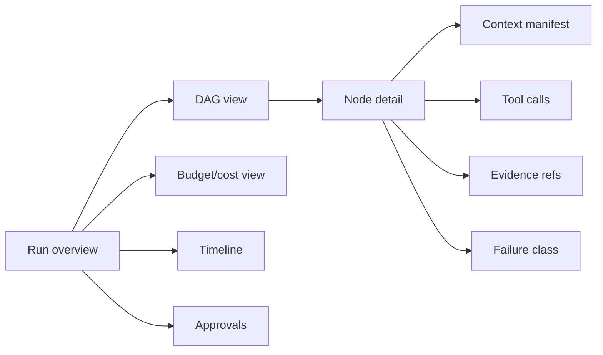

Minimum useful UI panels:

- Run status: goal, workflow profile, current node, blocked reason.
- DAG graph: ready/running/done/failed/blocked nodes.
- Budget ledger: tokens, cost, latency, retries by agent/model.
- Approval queue: exact operation, risk reason, diff/command preview.
- Evidence board: claims with sources, confidence, and taint labels.
- Failure explanation: failure class, root signal, next allowed action.
- Replay button: reconstruct state from event log.

### Explainability Contract

Every final run should answer:

1. What did the system think the task was?
2. Which files/context did it use, and why?
3. Which model/agent made each major decision?
4. Which tools mutated state?
5. Which checks passed/failed?
6. What was skipped because of budget, policy, or uncertainty?
7. What would be unsafe to automate next?

If the system cannot answer these, it is not production-ready no matter how good the model is.

### Configuration Discipline

Recommended config layers:

| Layer | Examples | User Exposure |
|---|---|---|
| Preset | `read_only`, `dev_safe`, `deep_review`, `fast_local` | Primary |
| Policy | allowed roots, shell denies, approval modes | Advanced |
| Model profiles | providers, costs, timeouts | Advanced |
| Routing rules | task type to profile mapping | Expert |
| Experimental knobs | branch factors, optimizer settings | Hidden/full profile only |

Do not expose every router weight to normal users. Configuration flexibility is not product power
if it makes correct operation impossible to reason about.

### Maintainability Decisions That Help

- Typed task contracts instead of prompt-only protocols.
- One tool broker instead of per-agent execution shortcuts.
- Append-only event log plus materialized views.
- Deterministic fast path for small tasks.
- Feature flags for experimental agent features.
- Golden trace tests for orchestration regressions.
- Stable presets over arbitrary knobs.
- Explicit "why not automated" explanations.
- Per-module ownership: routing, scheduler, memory, broker, dashboard, evals.

### What Not To Build Yet

- Fully peer-to-peer swarm.
- Self-modifying planner prompts.
- Cross-project automatic policy sharing.
- Learned router without sufficient labels.
- UI for every internal memory object.
- Recursive delegation.
- Always-on council.

These are attractive because they look intelligent. They are dangerous because they increase the
surface area of unexplained behavior.

## 12. Self-Improving and Adaptive Agent Systems

### Existing Seeds

Nulm already has ingredients for adaptation:

- skill registry with hit/acceptance/rejection telemetry;
- skill comparison and statistical thresholding;
- adaptive proposals gated by approval;
- audit logs;
- anomaly scoring;
- model routing profiles;
- workflow presets;
- benchmarks.

That is enough to build useful adaptation. It is also enough to build a slow-motion debugging
nightmare if adaptation mutates prompts, policies, routes, or skills without strict provenance and
approval gates.

### Adaptation Types

| Adaptation | Useful When | Dangerous When | Recommended Default |
|---|---|---|---|
| Skill recommendation | Repeated workflow appears in audit | Automatically executes new skill code | Suggest only |
| Context strategy tuning | Repeated token waste detected | Drops rare but critical context | Suggest or preset update |
| Model routing update | Outcome labels show cheaper model works | Optimizes on noisy/cherry-picked data | Shadow mode first |
| Prompt refinement | Stable benchmark improves | Prompt changes unversioned | Versioned experiment |
| Memory consolidation | Many runs produce stable facts | Summaries become false authority | Source-linked summaries |
| Cross-project learning | Generic workflow, no secrets | Leaks private patterns or bad policy | Metadata-only, opt-in |
| Workflow optimization | DAG pattern repeatedly succeeds | Freezes local workaround as global rule | Approval-gated proposal |
| Self-modifying code | Almost never | Breaks trust and auditability | Do not allow |

### Safe Adaptive Loop

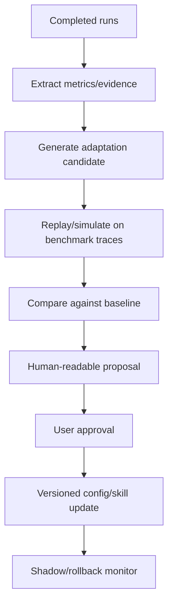

Adaptation must pass through simulation before it changes behavior.

### Memory Consolidation

Do not let agents write durable "lessons" directly. Use a consolidator:

1. collect repeated observations;
2. cluster by task/project/module;
3. link every proposed memory to source event ids;
4. label scope: project, repo, user, global;
5. label confidence and expiry;
6. review for secrets/private paths;
7. store as derived memory, never as source truth.

Example durable memory:

```json
{
  "kind": "workflow_lesson",
  "scope": "project",
  "claim": "For shell safety changes, run tests/test_shell_analysis.py first.",
  "source_event_ids": ["evt_1", "evt_9", "evt_22"],
  "confidence": 0.82,
  "expires_at": "2026-08-20T00:00:00Z",
  "taint": [],
  "approved": true
}
```

### Drift and Debugging Nightmares

Self-improving systems become unstable when:

- they optimize proxies instead of verified task success;
- they learn from their own hallucinated outputs;
- failures disappear into summaries;
- adaptation changes multiple knobs at once;
- old traces cannot be replayed under old config;
- "accepted by user" is treated as "correct";
- cross-project memories leak assumptions.

Hard rule: every adaptive change must be versioned, reversible, attributable, and benchmarked.

### Capability Evolution

Capability should evolve by adding explicit skills and workflow profiles, not by silently expanding
agent autonomy. A new capability should include:

- scope and trigger conditions;
- required tools and permissions;
- security review;
- benchmark scenarios;
- rollback behavior;
- telemetry fields;
- user-facing explanation.

If that sounds heavy, good. Capability creep is how agent systems become unmaintainable.

## 13. Migration and Transition Strategy

### Migration Principles

1. Preserve MCP tool names and behavior.
2. Keep deterministic local behavior without provider-backed AI.
3. Hide experimental orchestration behind `full` or explicit flags.
4. Route all new agent execution through existing policy/audit.
5. Add observability before autonomy.
6. Build typed contracts before complex planning.
7. Keep the single-agent fast path.
8. Never refactor shell safety and orchestration in the same step.

### Highest-ROI First Steps

| Step | ROI | Difficulty | Maintenance | Operational Risk |
|---|---:|---:|---:|---:|
| Add typed `TaskSpec`/`AgentRun` models | Very high | Medium | Low | Low |
| Add trace spans/events for agent runs | Very high | Medium | Medium | Low |
| Route subagent subprocess through tool broker | Critical | Medium-high | Medium | Medium |
| Add context manifest object | High | Medium | Medium | Low |
| Add route decision telemetry | High | Low-medium | Low | Low |
| Add benchmark scenario harness | High | Medium | Medium | Low |
| Add DAG node persistence to control plane | High | High | Medium | Medium |
| Add sandbox/worktree envelope | High | High | Medium | Medium-high |
| Add learned/adaptive router | Low now | High | High | High |

### Incremental Architecture

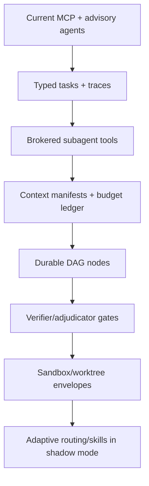

### Phase Plan

#### Phase A: Instrument Before Changing Behavior

Difficulty: Medium. Maintenance: Low. Risk: Low.

- Add `AgentRunRecord` emitted by orchestrator/dispatcher/subagents.
- Add route decision logging from `ai_router.py`.
- Add per-agent token/cost/latency fields even if zero/local.
- Add trace ids and correlation ids to current event bus/control plane records.
- Add markdown report generator for a run.

Why first: without this, later improvements cannot be measured.

#### Phase B: Typed Contracts Without New Autonomy

Difficulty: Medium. Maintenance: Low-medium. Risk: Low.

- Replace loose subtask dicts internally with dataclasses.
- Keep external MCP schemas unchanged.
- Add read/write set fields, budgets, expected artifacts, and permissions.
- Adapter layer converts old dict subtasks to new `TaskSpec`.
- Add tests for old behavior compatibility.

Danger point: do not redesign planner output and scheduler at the same time. First type the current
behavior.

#### Phase C: Tool Broker Enforcement

Difficulty: Medium-high. Maintenance: Medium. Risk: Medium.

- Create `AgentToolBroker` with methods for read/search/git/test/shell.
- Subagents receive broker in context, not permission matrix only.
- Replace direct `subprocess.run` in `git_agent`, `research_agent`, and `debug_agent`.
- Ensure all broker calls hit audit/policy or equivalent internal wrappers.
- Add bypass tests.

Danger point: shell/file security is the project's crown jewel. Keep changes narrow, test-heavy, and
do not relax deny patterns.

#### Phase D: Context Manifests and Budget Ledger

Difficulty: Medium. Maintenance: Medium. Risk: Low-medium.

- Add `ContextManifest` with file refs, summaries, digest, token estimate.
- Context curator uses existing indexing/relevance modules.
- Agents receive manifest refs, not whole memory.
- Budget ledger tracks estimated and actual tokens per node.

This phase directly attacks token waste without requiring a new scheduler.

#### Phase E: Durable DAG Runtime

Difficulty: High. Maintenance: Medium-high. Risk: Medium.

- Extend control plane with `runs.jsonl`, `nodes.jsonl`, `artifacts.jsonl`.
- Add node statuses, leases, retries, dependency tracking.
- Materialize current run state from append-only events.
- Keep the existing workflow engine as a compatibility facade.

Danger point: partial migration can create two sources of truth. Pick one event log as canonical and
derive views from it.

#### Phase F: Verification and Adjudication

Difficulty: Medium. Maintenance: Medium. Risk: Low-medium.

- Add independent verifier node type.
- Add conflict detector for write sets and patch overlap.
- Add decision records for accepted/rejected artifacts.
- Add failure classes for retry/replan/escalate.

This enables safe parallelism. Before this phase, parallel implementation should remain limited.

#### Phase G: Adaptive Systems in Shadow Mode

Difficulty: High. Maintenance: High. Risk: Medium-high.

- Let router/skill adaptation make recommendations only.
- Compare recommended route vs actual route offline.
- Require benchmark improvement before auto-applying profile changes.
- Add rollback for config/profile/skill changes.

Do not let adaptive routing mutate production defaults until it has weeks of labeled run data.

### Backward Compatibility Strategy

| Surface | Compatibility Rule |
|---|---|
| MCP tool names | Preserve existing names and JSON shapes |
| CLI commands | Add flags, do not change defaults |
| Audit logs | Version new records, keep old parser paths |
| Control plane | Append new record types; old task/approval views still work |
| Config | Add new keys with safe defaults |
| Tool profiles | Keep experimental features outside `standard` |
| Docs | Mark future architecture as staged, not current behavior |

### Dangerous Refactor Points

1. `shell_tools.py` and `_shell_safety.py`: high security risk. Touch only with focused tests.
2. `server.py` registration paths: public MCP compatibility risk.
3. `control_plane.py`: persistence migration risk.
4. `ai_router.py`: cost/security routing risk if cloud providers become default.
5. `agents/sub/*`: currently simple but bypass-prone; broker migration must be careful.
6. `workflow_engine.py`: can become duplicate scheduler if not retired behind facade.

### Architecture Paralysis Avoidance

Do not try to build the ultimate architecture in one refactor. The correct near-term target is:

- typed subtasks;
- brokered tools;
- traceable agent runs;
- context manifests;
- benchmark harness.

That package is enough to make the current system honest and measurable. Durable DAG scheduling and
adaptive routing can follow after metrics reveal the actual bottlenecks.

### Migration Exit Criteria

| Milestone | Exit Criteria |
|---|---|
| Typed agent contract | No orchestrator/dispatcher loose dicts except compatibility adapter |
| Brokered tools | No subagent direct subprocess/file mutation |
| Traceability | Every agent run has trace id, task id, model route, tools, artifacts |
| Context efficiency | Duplicate context ratio measured and reduced on benchmark suite |
| Durable DAG | Process restart resumes without duplicate mutation |
| Verification | Mutating DAGs require independent verifier pass |
| Adaptation | Suggestions benchmarked in shadow mode before application |

## Extension Final Position

The next-generation system should not be "more agents". It should be more measurement, more typed
state, more explicit routing, more bounded cognition, and more operator clarity. The project should
earn autonomy by proving each layer: route decisions are logged, cognitive loops are evidence-gated,
benchmarks measure cost per verified success, adaptive changes are reversible, and the operator can
explain a failed run without reading a novel-length transcript.

Complexity is justified only when it buys one of four things: lower verified cost, lower verified
risk, better recovery, or better operator comprehension. Everything else is architecture theater.
